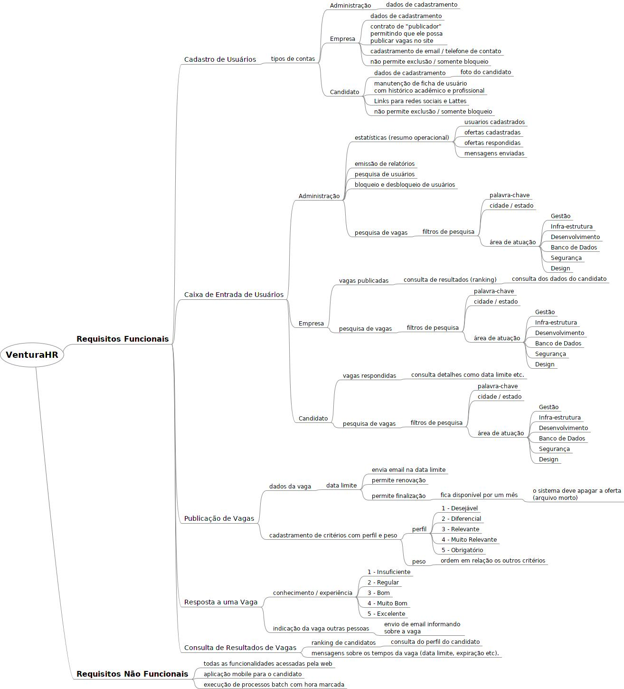
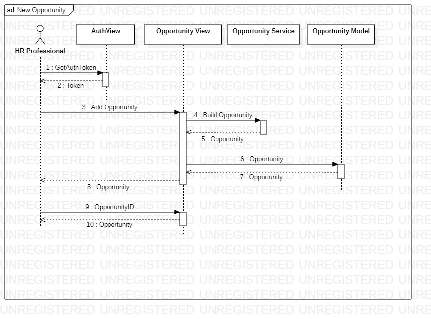
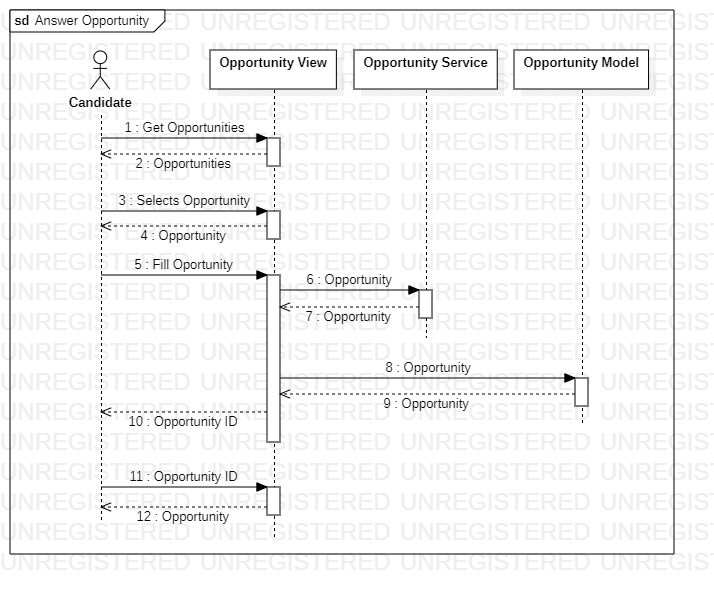
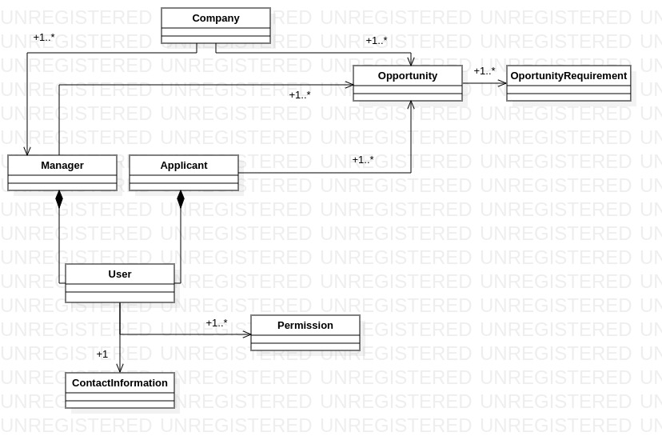
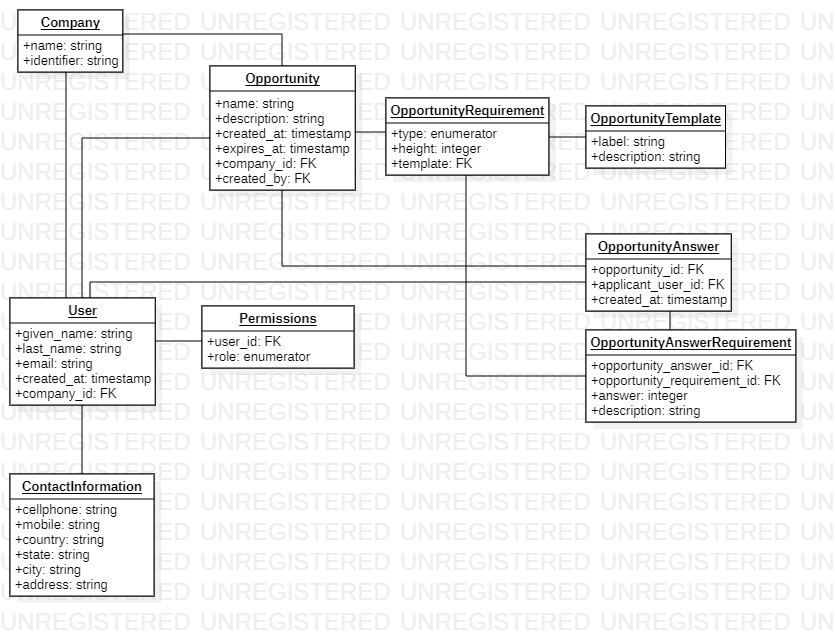

[](https://codecov.io/gh/jonathanabila/venturahr)

[](https://sonarcloud.io/summary/new_code?id=jonathanabila_venturahr)
[](https://sonarcloud.io/summary/new_code?id=jonathanabila_venturahr)
[](https://sonarcloud.io/summary/new_code?id=jonathanabila_venturahr)
[](https://sonarcloud.io/summary/new_code?id=jonathanabila_venturahr)

<p align="center">
    
</p>

<br>

<div align="center">
    <h3>ESCOLA SUPERIOR DE TECNOLOGIA DA INFORMAÇÃO</h3>
    <h3>GRADUAÇÃO EM ENGENHARIA DE SOFTWARE</h3>
    <br>
    <h3>Instituto INFNET - INFNET</h3>
    <br>
    <h4>TESTE DE PERFORMANCE - ASSESSMENT</h4>
    <h4>ENGENHARIA DE SOFTWARES ESCLÁVEIS</h4>
    <h4>ALUNO: JONATHAN TOLENTINO ABILA</h4>
    <h4>PROFESSOR: RICARDO PIRES MESQUITA</h4>
    <br>
</div>

# Índice
- [Índice](#índice)
- [Instruções](#instruções)
- [Introdução](#introdução)
  - [Propósito do documento](#propósito-do-documento)
  - [Escopo do projeto](#escopo-do-projeto)
  - [Definições](#definições)
  - [Referências](#referências)
- [Atores](#atores)
- [Requisitos](#requisitos)
  - [Casos de uso](#casos-de-uso)
  - [Matriz de Requisitos](#matriz-de-requisitos)
- [Diagrama Sequenciais](#diagramas-sequencias)
  - [Publicação da vaga](#publicação-da-vaga)
  - [Resposta da vaga](#resposta-da-vaga)
- [Diagrama de Classes](#diagrama-de-classes)
  - [Introdução](#introdução)
  - [Objetivo](#diagrama-de-classes-objetivo)
  - [Modelo de Domínio](#modelo-de-domínio)
  - [Diagrama](#diagrama)
  - [Projeto de Objetos](#projetos-de-objetos)
    - [Diagrama](#diagrama-projeto-de-objetos)
- [Tecnologias](#tecnologias)
  - [Comparações](#comparações)
- [Plano de Projeto](#plano-de-projeto)
- [Glossário](#glossário)
- [Principíos GRASP e Padrões GoF](#principíos-grasp-e-padrões-gof)
  - [Principíos GRASP](#principíos-grasp)
  - [Padrões GoF](#padrões-gof)
- [Processo de Desenvolvimento de Software](#processo-de-desenvolvimento-de-software)
  - [Ciclo de vida](#ciclo-de-vida)
  - [Processo Unificado](#processo-unificado)
  - [Etapas](#etapas)
  - [Desenvolvimento ágil](#desenvolvimento-ágil)

# Instruções

## Aplicação
Para executar a aplicação o comando deve ser:

```bash
docker-compose up
```

Com isso a aplicação será executada no endereço `http://localhost:8081/`.

## Banco de dados
Não é necessário realizar nenhum comando para a criação das tabelas no banco de dados, já que todo
o processo é controlado pelo docker, entretanto, se quiser forçar o processo pode executar:

## Grafana + Prometheus

Ambos estão disponiveis para monitorar o funcionamento da aplicação e pode ser accessados em:

- Prometheus: `http://localhost:9090`
- Grafana: `http://localhost:9091`

```bash
docker-compose up venturahr_migrator
```

# Introdução

## Propósito do documento

O objetivo desse relatório é esboçar e desenvolver um MVP para a VenturaSoft focado na recolocação de profissionais de TI,
tal sistema possui o diferencial de focar no perfil mínimo desejado, ao invés de buscar diversas stacks _stacks_ em um único,
exigindo conhecimentos que são muitas vezes impraticáveis.

## Escopo do projeto

O escopo do projeto está ao redor do sistema VenturaHR, brevemente descrito acima, que permitira com que candidatos busquem
vagas de empregos e apliquem o seu perfil para tal, e, em simultâneo, permitirá as empresas realizarem publicações em busca de candidatos
que possuam o PMD (Perfil Mínimo Desejado) para a vaga.

Para descrever o PMD a empresa poderá utilizar um rank indo de 1 (desejável) até 5 (obrigatório), além do peso atribuído para o critério -
a partir do qual será possível calcular o perfil da oportunidade e seus candidatos, sendo que quanto maior o perfil do candidato com a vaga,
maior é a sua compatibilidade com os requisitos listados.

Um mapa mental com os requisitos descritos em alto nível do projeto pode ser visualizado nessa imagem:

<p align="center">
    
</p>

Também há o documento [Documento de Visão](./docs/vision_venturasoft.pdf) que possui uma visão mais detalhada sobre a solução
desejado de uma maneira geral do ponto de vista de negócios.


## Definições

- Requisitos funcionais: Descrevem quais as funcionalidades devem estar presentes no sistema da perspectiva do usuário.
- Requisitos não funcionais: Descrevem características qualitativas do sistema, isto é, recursos do qual o sistema precisa
ter para cumprir os seus objetivos.
- Casos de Uso: Descrevem o comportamento do sistema do ponto de vista do usuário, fornecendo uma descrição funcional do sistema.
- Atores: Descrevem agentes que interagem com o sistema, representando uma regra, não um usuário individual do sistema.

## Referências
- [Disciplined Agile Delivery: A Practitioner’s Guide to Agile Software Delivery in the Enterprise by](https://www.oreilly.com/library/view/disciplined-agile-delivery/9780132810098/)
- [Diagramas Estruturais da UML: Diagrama de Objetos](https://micreiros.com/diagrama-de-objetos/)


# Atores

A lista de atores para o sistema descrito acima, assim como os seus papéis, brevemente descritos, são:

- Tempo: Agente responsável por realizar acionamento do sistema para funções programadas.
- Sistema de agregamento: Responsável por realizar o agregamento e elaboração do relatório ao final do período de publicação
da vaga, além de disponibilizar um relatório sobre o andamento dos processos.
- Sistema de autenticação: Responsável por realizar a autenticação e autorização dos usuários na plataforma.


- Candidato: Profissional de TI que está buscando uma vaga.
- Profissional de RH: Responsável por realizar a publicação da vaga e manutenção das vagas.
- Gerente: Responsável por criar e delegar acessos à plataforma de publicação de vagas, além das
ações disponíveis para o profissional de RH.


# Requisitos

## Casos de uso

### UC-01
O usuário acesso o site e não está logado. Dessa forma, seleciona a opção para realizar o login para acessar a plataforma.

### UC-02.01
O usuário acessa o site, porém não possui um perfil, para tal ele seleciona a opção de criar um perfil para visualizar e possivelmente
se candidatar as vagas.

### UC-02.02
O usuário após acessar o site, deve ser capaz de atualizar as suas informações pessoais, tais como meios de contato.

### UC-03
O usuário acessa o site, porém não possui um acesso para publicar as vagas, nesse caso o profissional precisa entrar em contato com o
administrador da conta para providenciar o acesso para ele.

### UC-04.01
Um profissional de RH deseja publicar uma nova vaga, para tal, ele acessa o sistema com o seu login e realiza o processo de publicação da
vaga. Após o processo, ele visualiza a vaga publicada.

### UC-04.02
Durante o processo de cadastro de uma vaga ele não adiciona o PMD para um critério, ao tentar salvar a vaga o sistema bloqueia e
mostra um erro na tela explicando que todos os critérios precisam de um PMD.

### UC-04.03
Durante o processo de cadastro de uma vaga ele não adiciona o peso para um critério, ao tentar salvar a vaga o sistema bloqueia e
mostra um erro na tela explicando que todos os critérios precisam de um peso.

### UC-04.04
Durante o processo de cadastro de uma vaga o usuário não adiciona nenhum critério, ao tentar salvar a vaga o sistema bloqueia e mostra
um erro na tela explicando que o usuário deve adicionar um número mínimo de critérios.

### UC-04.05
Durante o processo de cadastro de uma vaga o usuário não adiciona nenhuma descrição para o critério, com isso o sistema não permite
que a vaga seja salva mostrando ser necessário incluir as descrições para todos os critérios.

### UC-05.01
O candidato deseja se inscrever em uma vaga, para isso ele acessa a página da vaga e seleciona a opção para preencher o formulário conforme
o seu perfil, após finalizar o preenchimento ele salva e vê que sua candidatura foi concluída.

### UC-05.02
O candidato deseja se inscrever em uma vaga, para isso ele acessa a página da vaga e seleciona a opção para preencher o formulário,
porém não concluir a seleção da sua experiência em todos os critérios, e ao tentar salvar sua aplicação visualiza um erro dizendo que é
necessário que ele preencha todos os critérios.

### UC-05.03
O candidato abre a vaga para se inscrever, porém, desiste de prosseguir com o processo de candidatura, com isso fecha o site. O sistema não pesiste
o seu progresso, tendo que reiniciar o processo.

### UC-05.03
O candidato abre a vaga para se inscrever, porém, desiste de prosseguir com o processo de candidatura, com isso fecha o site e seleciona a opção
para salvar o seu progresso, com isso na próxima vez que abrir a vaga poderá prosseguir com o preenchimento da sua candidatura.

### UC-06.01
O candidato tenta acessar uma vaga por meio da sua url, porém o período para captação de profissionais já encerrou, com isso ele vê uma página
explicando que o processo já foi finalizado.

### UC-06.02
O candidato acessa suas vagas que estão salvas sem finalizar e tentar prosseguir com o cadastro de suas experiências, porém o prazo já se encerrou
e ele é direcionado para uma página explicando que o processo já foi finalizado.

### UC-07.01
Ao final do período que a vaga fica disponível para a captação de profissionais o sistema envia um email para o responsável pela vaga com um link com
o resultado para a captação.

### UC-07.02
Ao final, o usuário responsável pela vaga acessa o seu painel para a vaga e seleciona a opção para extender o tempo que a vaga ficará disponível por
mais um mês.

### UC-07.03
Ao final, o usuário responsável pela vaga acessa o seu painel para a vaga e seleciona a opção finalizar de fato o processo de captação de profissionais.

### UC-07.04
Ao final, o usuário responsável não estende ou fecha a vaga, com isso o sistema fecha a vaga após dois dias como comportamento padrão.

### UC-08.01
O usuário responsável pela vaga deseja acessar o sistema para visualizar mais informações sobre o perfil dos usuários que tiveram uma nota maior ou
iqual ao perfil da vaga.

### UC-08.02
O usuário seleciona o perfil de um usuário com a nota maior que o perfil da vaga e consegue visualizar informações de contato com o profissional.

## Matriz de Requisitos

| ID    | Nome     | Descrição                                                                                                              | Prioridade | Complexidade   | Observações                                                                                                                                                                                                                           |
|-------|----------|------------------------------------------------------------------------------------------------------------------------|------------|----------------|---------------------------------------------------------------------------------------------------------------------------------------------------------------------------------------------------------------------------------------|
| RF-01 | UC-01    | O usuário deve ser capaz de realizar o login na plataforma, sendo uma empresa ou candidato.                            | Essencial  | Médio          | A complexidade do login depende do sistema que estiver sendo utilizado e do framework que irá lidar com todo o processo de autenticação.                                                                                              |
| RF-02 | UC-02.01 | O usuário deve ser capaz de criar a sua conta de candidato de forma autônoma.                                          | Essencial  | Médio          | A complexidade por trás dessa funcionalidade é devido ao processo como um todo, e não a característica do tipo da conta.                                                                                                              |
| RF-03 | UC-02.02 | O usuário deve ser capaz de alterar os dados pessoais.                                                                 | Importante | Fácil          | Após a implementação do perfil do usuário, realizar a atualização dos seus dados cadastrais não é complicado. Porém, não é uma feature essencial para o MVP, dado que o sistema não depende dessa característica para entregar valor. |
| RF-04 | UC-03    | O usuário da empresa deve ser capaz de realizar o login utilizando seus dados de acesso.                               | Essencial  | Médio          | A diferenciação dos perfis não é algo complexo, após implementado o login pode ser realizado por meio de páginas diferentes que passam paramêtros diferentes para especificar o usuário.                                              |
| RF-05 | UC-04.01 | O usuário da empresa deve ser capaz de criar uma nova vaga.                                                            | Essencial  | Médio          | A criação da vaga também não apresenta complexidade, porém é um passo pequeno no processo de construção de todo o sistema.                                                                                                            |
| RF-06 | UC-05.01 | O candidato deve conseguir se inscrever em uma vaga publicada por uma empresa.                                         | Essencial  | Médio          | A complexidade está no fato que devemos criar o relacionamento entre as entidades para persistir o candidato que se inscreveu.                                                                                                        |
| RF-07 | UC-06.01 | O candidato deve ser capaz de acessar uma vaga por meio da url.                                                        | Desejável  | Fácil          | Compor a url com uma chave primária é suficiente para que o usuário possa acessar a vaga por meio da url.                                                                                                                             |
| RF-08 | UC-07.01 | O sistema deve enviar um e-mail para o responsável pela vaga após o período de publicação da vaga.                     | Importante | Fácil          | Um sistema de job/cron é suficiente para iniciar o processo que envia o email.                                                                                                                                                        |
| RF-09 | UC-07.02 | O responsável pela vaga deve ser capaz de extender a publicação da vaga após a 30 dias.                                | Importante | Fácil          | A alteração deve ser realizada na tabela do banco de dados para que a data final seja alterada.                                                                                                                                       |
| RF-10 | UC-07.03 | O responsável deve ser capaz de visualizar um compilado dos usuários que aplicaram a vaga e suas notas.                | Desejável  | Fácil          | Precisamos alimentar uma tabela com uma query simples sobre os usuários que aplicaram para a vaga.                                                                                                                                    |
| RF-11 | UC-08.01 | O responsável pela vaga deve ser capaz de visualizar os dados de contato de um candidato após ele aplicar para a vaga. | Importante | Fácil          | Por meio das chaves primárias devemos disponibilizar as informações do candidato.                                                                                                                                                     |
| NF-12 |          | Uma vaga publicada deve estar disponível para os candidatos em até 1 minuto após a sua publicação.                     | Importante | Médio          | Para que seja possível o sistema escalar ao longo prazo é necessário levar em consideração a quantidade de operações que serão realizadas.                                                                                            |
| NF-13 |          | A tela de publicação deve ser clara o bastante para que uma pessoa sem treinamento consiga entender e utilizar.        | Essencial  | Complexo       | UX é umas das partes mais complexas do desenvolvimento de um projeto quando levamos em conta a interação com o usuário.                                                                                                               |
| NF-14 |          | O sistema deve ser capaz de ser executa em um dispositivo mobile para os candidatos.                                   | Essencial  | Complexo       | UX para dispositivos mobiles durante o desenvolvimento de um único sistema consome muito tempo e testes, além de possui um nível de complexidade para readequar os componentes.                                                       |
| NF-15 |          | O sistema de login deve impedir qualquer acesso não identificado ao sistema.                                           | Essencial  | Médio          | A implementação de um sistema simples de autenticação e autorização não é complicado dado a quantidade de frameworks existentes.                                                                                                      |
| NF-16 |          | O sistema deve estar disponível para acesso em 99% do tempo.                                                           | Desejável  | Muito Complexo | Para lidar com possíveis falhas precisamos aplicar redundâncias em todas as partes do sistema.                                                                                                                                        |
| NF-17 |          | O tempo de resposta para todas as páginas deve ser inferior a 200ms.                                                   | Desejável  | Complexo       | Realizar a otimização dos processo do ponto de vista arquitetural pode demandar um nível de trabalho elevado.                                                                                                                         |
| NF-18 |          | O sistema deve possuir ao menos um teste E2E.                                                                          | Importante | Médio          | Devemos implementar ao menos um teste E2E para garantir o funcionamento do projeto antes de realizar uma nova release.                                                                                                                |
| NF-19 |          | O sistema deve validar os inputs dos usuários em ambas as pontas.                                                      | Importante | Fácil          | Não podemos permitir que entradas incorretas sejam realizadas, por isso devemos validar a entrada em ambas as pontas.                                                                                                                 |
| NF-20 |          | A tela inicial deve fornecer uma experiência diferente para candidatos e empresas.                                     | Importante | Fácil          | O público é diferente, por isso devemos possuir uma página diferente para cada usuário.                                                                                                                                               |
| NF-21 |          | O sistema deve possuir uma fácil execução local.                                                                       | Desejável  | Médio          | A experiência dos desenvolvedores irá ditar a velocidade com que novas funcionalidades podem ser entregues.                                                                                                                           |


# Diagrama Sequenciais

Os diagramas abaixo apresentam a sequência de comunicação entre o Ator e o sistema, dessa forma só está representado o fluxo para o caminho feliz,
isto é, simples e direto.

## Publicação da vaga
<p align="center">
    
</p>


## Resposta da vaga
<p align="center">
    
</p>


# Diagrama de classes

### Introdução
UML, “Unified Modeling Language” ou Linguagem de Modelagem Unificada, é uma linguagem que busca padronizar a modelagem
e estruturação de projetos de softwares. O objetivo mais simples da UML é representar sistemas de formas padronizadas,
reduzindo possíveis erros e interpretações incorretas de documentações ou até mesmo o código.

Diferente de “frameworks” ou metodologias que buscam te apresentar uma receita de bolo de como e quando realizar
determinadas tarefas, a UML busca lhe auxiliar provendo ferramentas para visualizar e entender a comunicação entre os
seus objetos.

Um estudo conduzido por Sebastian Baltes com 394 pessoas envolvidas na indústria de softwares e com uma média de 10 anos
de experiência, mostrou que majoritariamente o uso de interfaces analógicas para a criação de diagramas, desses 58%
analógicos somente 38% era arquivado e sobrevivia por alguns dias, já no meio digital 94% do conteúdo era arquivo e
sobrevivia por meses.

Entres os diagramas, 47% mostraram que ajudavam a entender o código criado por outras pessoas. Os principais
objetivos dos diagramas eram: realizar o design do software, explicar e entender o que foi feito – mostrando que a
utilização do diagrama e o correto arquivamento das evidências geradas ajudam o time seja relembrando conceitos,
explicando para novos desenvolvedores ou para pessoas envolvidas com as regras de negócio.

<h3 id="diagrama-de-classes-objetivo">Objetivo</h2>

Com base nos requisitos acima, casos de uso e diagrama de classes esboçaremos um sistema para a empresa VenturaSoft
focado na recolocação de profissionais de TI.

O diagrama de classes abaixo é uma representação do sistema, não contendo os possíveis métodos e atributos nesse momento,
de tal forma que o foco é o nome das classes, relacionamentos e multiplicidade.

### Modelo de Domínio
Nesse projeto o diagrama de classes e o modelo de domínio estão sendo apresentados juntamente devido a sua semelhança, reduzindo a
quantidade de documentos e criar uma situação melhor para manter o conteúdo atualizado.

### Diagrama

O diagrama de classe abaixo apresenta o nome das classes, relacionamento e multiplicidade:


<p align="center">
    
</p>

## Projeto de Objetos

### Diagrama Projeto de Objetos
Não encontrei nenhuma referência no material do UML sobre Projeto de Objetos, dessa forma, acredito que se trate do diagrama de objetos, dessa forma
esse será apresentado a seguir:

### Diagrama

<p align="center">
    
</p>


# Tecnologias

O projeto será desenvolvido para realizar a entrega do sistema venturaHR com base na execução em qualquer máquina, além de utilizar
tecnologias que estão no mercado atual e possuem suporte a atualizações de segurança constantes.

Dessa forma, as tecnologias que serão utilizadas são:
- Frontend
  - Django Template (HTML + CSS + Javascript)
- Backend
  - Django (Python)
- Bando de dados
  - PostgreSQL
- Docker + Docker compose

A utilização do docker permitira que possamos migrar entre diferentes ambiente sem ter que modificar o nosso projeto para que funcione
no ambiente, podendo realizar a portabilidade entre a AWS ECS para Heroku com facilidade, além de criar um ambiente local robusto
independente do sistema operacional utilizado.


## Comparações

Para chegar nas tecnologias utilizadas exite duas maneiras de visualizar a situação:
- Tecnologia
- Frameworks

A escolha da tecnologia, foi baseada em qual eu possuo mais familiaridade, dessa forma, as escolhas eram:
- Python: Python é a linguagem que utilizei e utilizo pelos últimos 4 anos.
- Javascript: Possuo alguma familiaridade, porém desconheço muitos dos passos necessários para uma boa arquitetura.
- Java: Todo o conhecimento que possuo foi gerado na faculdade ao longo do processo de graduação.

Dessa forma, a escolha de tecnologia foi bem simples, isto é, tecnologia que possuo mais familiaridade.

Entre as ferramentas disponíveis para a construção dos sistemas há uma lista gigantesca, porém seguindo o mesmo,
familiaridade, as opções eram:

Banco de dados
- NoSQL:
  - Fácil de implementar, dado que possui diversas integrações e ORMs.
  - Consegue receber uma quantidade muito grande de requisições sem necessitar de escalabilidade vertical.
  - Possui diversos serviços que fornecem a estrutura com um contrato semelhante:
  - Difícil de manter um sistema de chave estrangeira.
  - Composição de índices depende da tecnologia utilizada, DynamoDB vs MongoDB, por exemplo.
- PostgreSQL vs MySQL:
  - Escalabilidade horizontal ótima, além de suportar uma grande quantidade de requisições em um
banco de dados bem construído.
  - Possui diversas integrações com frameworks e ORMs disponíveis no mercado.
  - Diversas clouds possuem implementações que são compatíveis entre si, facilitando a implementação.
  - Diferente do NoSQL necessita de um controle ativo para a estrutura do banco de dados.
  - Necessita de uma consciência e estruturação maior antes da implementação, já que processamento analítico
consome uma muitos recursos disponíveis.

# Plano de Projeto
Para as seguintes interações os entregais serão:
- Atualização cadastral (UC-02)
- Publicação de vagas (UC-04)
- Inscrição na vaga (UC-05)

Com seus respectivos sub casos de uso.

# Glossário
Para o projeto VenturaHR o glossário disponível é:
- Perfil Mínimo Desejado (PMD): O perfil mínimo desejado é o valor mínimo para o perfil do candidato. A conta
é feita somando todos os pre-requisitos e multiplicando pelo peso associado, esse valor seria o perfil do candidate.
- Data de Expiração: Data em que a vaga irá ser desativada no sistema.
- Candidato: Pessoa que possui acesso ao sistema para se cadastrar em vagas.
- Empresa: Unidade representativa para criar um elo entre as vagas e os candidatos.
- Gerente: Pessoa que criou a empresa, e com isso é responsável por delegar os acessos à conta.
- Profissional de RH: Pessoa que possui acesso à conta e é responsável por publicar as vagas

# Principíos GRASP e Padrões GoF

Tanto quanto os principíos GRASP e os padrões GoF buscam tornar o código mais flexível, fácil de manter e objetivo, tornando a continuidade
do projeto muito mais simples do ponto de vista técnico.

Os principíos GRAPS possuem alguns conceitos básicos da orientação a objeto, tais como encapsulamento, abstração e polimorfismo, e dentro do catálogo
há outros padrões conhecidos.

Já os padrões GoF (Gang of Four) são referentes a série de livros escritas sobre melhores práticas de programação, buscando o mesmo objetivo do GRASP, porém
de uma maneira diferente.

## Aplicação

Nenhum dos nomes conhecidos no GoF foram utilizados no projeto de maneira direta, entretanto é possível correlacionar algumas classes:
- Services <-> Builder: Responsável por encapsular (GRAPS) a construção dos objetos e as regras de negócio.
- Decorator <-> LoginView: Responsável por realizar a interação com o usuário (Controller) e permitir ou não o acesso.
- Command <-> Models: Responsável por encapsular (GRAPS) a relação com o banco de dados, removendo o acoplamento entre a aplicação e o banco de dados.

Dessa forma, a aplicação aplica e aplicará mais conceitos, tais como Singletons para manter as views rodando uma única instância e as descritas acima.

# Processo de Desenvolvimento de Software

## Ciclo de vida
Dentre os ciclos de vida disponíveis, o que Exploratório é o ciclo mais adequado para o processo de desenvolvimento do venturahr,
dado que a equipe é enxuta, uma única pessoa, e a diversidade de experiências é reduzida por esse fato, dificuldades surgiram ao longo
do projeto, fazendo com que seja mais simples se adequar com uma estrutura menos rígida.


## Processo Unificado
De forma geral, iremos implementar as principais características do Processo Unificado, são elas:

- Processo incremental: Toda interação irá resultar em um incremento comparado com a versão anterior.
- Arquitetura: Focar na arquitetura do projeto, fazendo com que seja possível tomar diferentes decisões ao longo do projeto
sem ter que pagar um preço alto, do ponto de vista técnico e tempo, devido a decisões que limitaram o escopo de ação.
- Risco: Iremos focar na parte mais critica do projeto, isto é, que entrega o maior valor e possui a maior dificuldade envolvida,
o que poderia impossibilitar a construção do sistema.

## Etapas
O processo pode ser dividido em:

- Concepção: No qual iremos investir tempo em descobrir o projeto a ser construído, tomando pequenas decisões ao longo do processo, que buscam
entregar valor, tais como, criação de metas, comunicação com os stakeholders sobre a visão e idealização do projeto.

- Construção: Na etapa que iremos de fato construir o projeto, buscando implementar pequenas funcionalidades que nos permita entregar valor
rapidamente e colher novos feedbacks dos stakeholders, para caso seja necessário adequar

- Transição: Momento que iremos passar o conhecimento de forma definitiva sobre o sistema e finalizar possíveis documentos sobre o funcionamento
e decisões tomadas ao longo do projeto.

## Desenvolvimento ágil
Para esse projeto iremos manter os elementos os seguintes elementos do desenvolvimento ágil:

- Entrega contínua: Realizar a entrega de pequenas funcionalidades que entregam valor de forma contínua para o venturahr.
- Progresso: Iremos medir o nosso progresso com base no software desenvolvido, e não somente por documentações ou reuniões.
- Qualidade: Continua atenção a qualidade do produto sendo desenvolvido, dessa forma não iremos gerar retrabalho e necessidade
de aumentar o prazo para conseguir implementar uma nova funcionalidade.
- Cliente: Manter a proximidade com o cliente para podermos colher feedbacks constantes sobre a evolução do projeto.
- Comunicação: Buscar o engajamento no projeto, além de excelentes documentos que mostram os motivos por trás das decisões técnicas
e de negócios feitas no passado.
